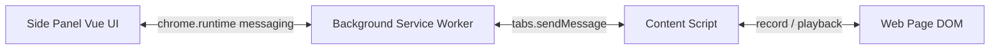

# Plan: Web Automation Test

## Tujuan

Chrome Extension untuk record / playback automation test di browser, mirip Selenium IDE dan Ui.Vision, dengan UI di Chrome Side Panel.

## Keputusan teknis (tetap)

- **Manifest V3** + **Chrome Side Panel API**
- **Vue 3** + **WXT** (Vite-based extension tooling) — build Side Panel, background, content script dalam satu project; hindari boilerplate manual
- UI copywriting **bahasa Inggris**
- Persistensi MVP: `chrome.storage.local` + export/import **JSON**
- Tidak ada backend / web app di Fase 1–2 (web app masuk Fase 3)

## Arsitektur



| Komponen | Tanggung jawab |
| --- | --- |
| Side Panel (`entrypoints/sidepanel/`) | Record/Stop/Play, daftar step, edit dasar, save/load JSON |
| Background (`entrypoints/background.ts`) | Orkestrasi state (idle/recording/playing), inject/relay message, buka side panel |
| Content script | Capture event saat record; resolve selector + jalankan aksi saat playback |
| Shared (`shared/`) | Tipe step, schema JSON, selector builder, message protocol |

## Format test case (JSON)

```json
{
  "version": 1,
  "name": "Login flow",
  "createdAt": "ISO-8601",
  "updatedAt": "ISO-8601",
  "steps": [
    {
      "id": "uuid",
      "type": "click",
      "selectors": ["#login", "css=#login", "xpath=//*[@id='login']"],
      "value": null,
      "url": null
    }
  ]
}
```

**Step types Fase 1:** `navigate`, `click`, `dblclick`, `input`, `change` (select/checkbox/radio), `submit`.

**Step types Fase 2+:** `waitForElement`, `assertVisible`, `assertText`, `assertUrl`, `assertEnabled`, `assertValue`.

## Struktur project (target)

```
automation/
  .plan/init.md
  package.json
  wxt.config.ts
  tsconfig.json
  entrypoints/
    background.ts
    sidepanel/
      index.html
      App.vue
      main.ts
      components/   # StepList, Toolbar, etc.
    content.ts      # atau content/index.ts
  shared/
    types.ts
    messages.ts
    selector.ts
    storage.ts
  public/icons/
  README.md
```

## Scope

**In scope (produk):** Chrome Extension only (Fase 1–2, 4–6 sesuai roadmap); Vue JS Side Panel.

**Out of scope MVP:** assertion lanjutan, screenshot report, variables/loops, CI/CD, web app multi-user, over-abstracted framework.

## Roadmap (ringkas)

| Tahap | Fitur | Target |
| --- | --- | --- |
| 1 | Extension scaffold, record, stop, playback sederhana, save/load JSON | MVP |
| 2 | Selector editor, assertion, explicit wait | Reliable execution |
| 3 | Web app, penyimpanan test case & suite | Test management |
| 4 | Execution report, screenshot, debugging | Reporting |
| 5 | Variables, loops, conditional, reusable steps | Advanced automation |
| 6 | Scheduled execution & CI/CD | Automated regression |

---

## Fase 1 — MVP (detail implementasi)

### 1. Scaffold

- Init WXT + Vue 3 + TypeScript
- `manifest`: `sidePanel`, `storage`, `scripting`, `activeTab` / host permissions sesuai kebutuhan record di semua URL (`<all_urls>` dengan alasan jelas di README)
- Action icon membuka Side Panel (`sidePanel.setPanelBehavior({ openPanelOnActionClick: true })`)
- README singkat: load unpacked, cara record/play

### 2. Message protocol (`shared/messages.ts`)

Contoh perintah:

- UI → BG: `START_RECORDING`, `STOP_RECORDING`, `START_PLAYBACK`, `STOP_PLAYBACK`, `GET_STATE`, `SAVE_TEST`, `LOAD_TEST`
- BG → Content: `SET_MODE` (`idle` \| `record` \| `play`), `RUN_STEP`, `CANCEL_PLAYBACK`
- Content → BG: `STEP_RECORDED`, `STEP_RESULT`, `NAVIGATION`

State tunggal di background agar Side Panel bisa re-attach tanpa kehilangan mode.

### 3. Record

Content script (capture phase) merekam:

- click / dblclick
- input (debounce untuk typing) + change untuk select/checkbox/radio
- submit
- navigasi / URL change (dibantu background via `webNavigation` atau tab update → step `navigate`)

**Selector strategy (sederhana, multi-fallback):**

1. `#id` jika unik
2. `data-testid` / `name` jika ada
3. CSS path pendek (tag + nth-of-type terbatas)
4. Optional XPath singkat sebagai fallback

Setiap event → `STEP_RECORDED` → background append ke test case aktif → Side Panel refresh list.

**Filter:** abaikan interaksi di dalam extension UI; jangan rekam event sintetis dari playback.

### 4. Playback

- Jalankan step berurutan di tab aktif
- Resolve selector: coba `selectors[]` sampai match
- Aksi: click, isi value, trigger `input`/`change` agar framework page ikut terpicu
- Antar-step: short delay tetap (mis. 100–300ms) — **belum** explicit wait (Fase 2)
- Error: stop playback, tandai step gagal di UI (pesan Inggris)
- Navigasi: tunggu `tabs.onUpdated` status `complete` sebelum step berikutnya jika step `navigate` atau menyebabkan unload

### 5. Side Panel UI (Vue, copy Inggris)

- Toolbar: **Record** / **Stop** / **Play** / **Clear**
- Step list (type, selector ringkas, value)
- Edit dasar MVP: hapus step, ubah value, ubah selector string pertama
- **Export JSON** / **Import JSON**
- Status bar: Idle | Recording | Playing | Failed

Hindari dashboard berat: satu panel, satu alur.

### 6. Storage

- Autosave draft ke `chrome.storage.local`
- Export file `.json` download; import via file picker

### 7. Validasi Fase 1

- Record form sederhana → Play sukses di halaman yang sama
- Reload extension / tutup-buka side panel → state & draft masih ada
- Import JSON yang diexport → Play jalan
- Tidak ada step ganda berlebih saat typing (debounce OK)
- Tidak merekam event saat mode Play

---

## Fase 2–6 (outline saja; detail saat tahap dimulai)

- **Fase 2:** UI edit selector (highlight di page), assertion steps, `waitForElement` / timeout konfigurabel, reorder/add step di editor
- **Fase 3:** web app + sync/storage test suite (di luar extension-only)
- **Fase 4:** report per step (pass/fail, duration), screenshot on fail, history
- **Fase 5:** variables, if/loop, reusable step groups
- **Fase 6:** headless/CI runner atau export ke script + scheduling

## Notes

- Copywriting UI: English
- Hindari overengineering
- Validasi tiap perubahan; cegah regresi (checklist Fase 1 di atas)
